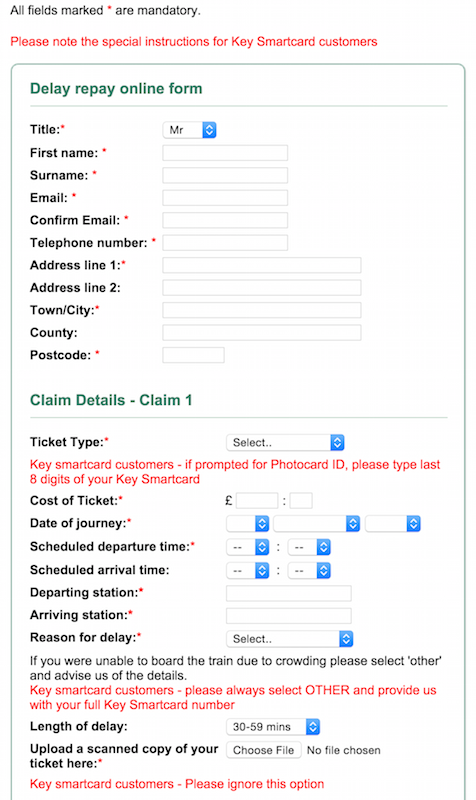
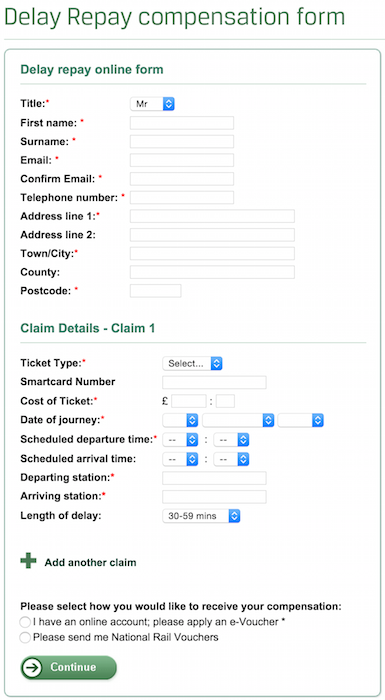

# southern railway smartcard delay repay

The Southern Railway Delay Repay form is awful, especially if you hold a smartcard.
Just [look at it](https://www.southernrailway.com/your-journey/customer-services/delay-repay/delay-repay-form)!

* What's with all the red text everywhere?!
* Why isn't there a separate form for smartcard holders, rather than mashing the two forms together?!
 
Inspired by [@rem](https://twitter.com/rem/status/592333171578032128) this chrome extension will make this form simpler for smartcard holders.

## Usage
I don't want to pay the $5 fee for hosting this extension in the Chrome Store just yet.
To use this extension, download the latest release [from here](https://github.com/akash1810/southern-railway-smartcard-delay-repay/releases), 
unzip it then load it as an [unpacked extension](https://developer.chrome.com/extensions/getstarted#unpacked).

## Southern's Form

## What the chrome extension does:
This extension cleans the form up to look like this:

In an overview, the following actions are performed:
  * Narrows down `Ticket Type` by removing options unrelated to the smartcard.
  * Fields that are not relevant are hidden. These include:
    - `Photocard ID`
    - `Reason for delay`
    - `Upload scanned copy`
    - `I have previously`
  * The `Details of delay` field is changed from a `textarea` to an `input` of type number and of length X. It is also moved further up the page and renamed.
  * `Photocard ID` is auto filled from `Details of delay`.
  * The copy is also trimmed down to remove the verbose warnings/information.
  
The payload of the `POST` request remains unchanged so the form operates as before.

## Contributing
This extension was scaffolded using the [yeoman generator](https://github.com/yeoman/generator-chrome-extension) and as such has handy grunt tasks!

Checkout this repository, then run `npm install` and `bower install` to install the dependencies. Load the unpacked extension, then run `grunt debug` to 
live reload your changes.