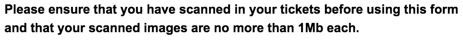
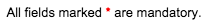
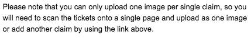
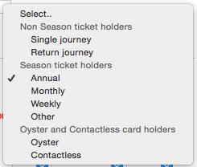
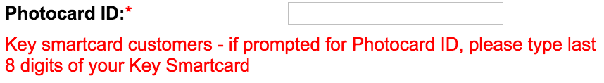
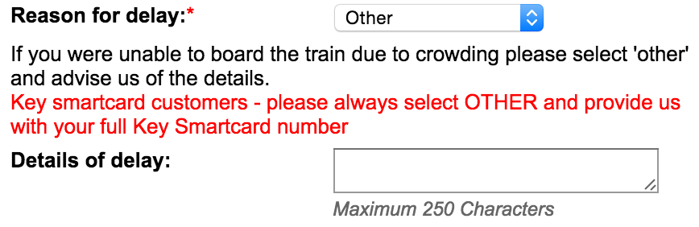
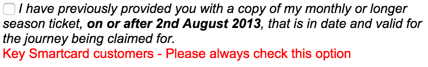

This is a full listing outlining why the current Southern Railway Delay Repay form is so painful for smartcard holders.

# Upload of scanned ticket
This message is at the top of the form:

But then there is this message below the upload button:

Even more confusing is that this is apparently a mandatory field!

There is also other pointless copy futher down too:

# Ticket Type
The ticket type has these options, when only Annual, Monthly, Weekly and Other really apply to smartcard users.

# Photocard ID
Smartcard users are informed to not enter their Photocard ID in the Photocard ID field, instead enter the last 8 digits
of their smart card?!

# Reason for delay
Smartcard holders are told not to enter the reason for delay in this field, instead, enter their full smartcard number?!

# I have previously...
Nevermind what this checkbox is for, smartcard users please always check this option!

# The Extension
In essence, this extension makes this message completely redundant:

* It hides all the pointless copy that does not apply to smartcard users.
* It hides all the pointless fields that do not apply to smartcard users.
* It renames the `Reason for delay` to `Smartcard Number` and will automatically fill in the `Photocard ID` with the last 8 characters of the smartcard number.
* It maintains the same functionality as the standard form behind the scenes... give it a try!